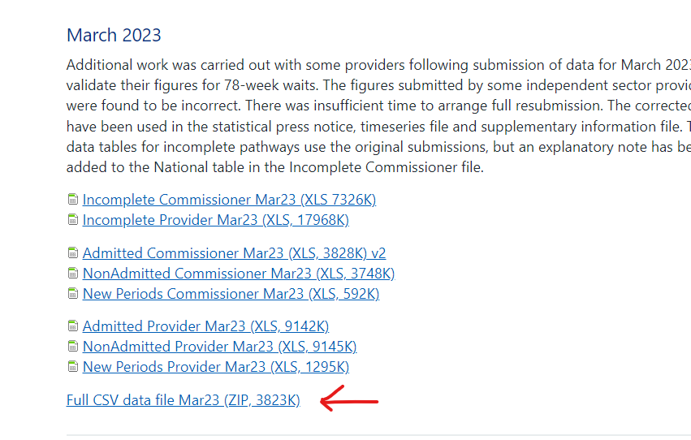

# understanding this repository

## Streamlit
apps folder contains code for the mortgage calculator
components folder contains code for templates given by streamlit

## NHS data
all the data sources are inside /data
the /data/apptx stores the individual data by months

to map the regional data from the productivity to the NHS data, `/data/mapping.xlsx` stores the list of trusts on the left and their relevant region. this is currently randomly assigned appart from those highlighted

## setup
the two notebooks required to run this data is `preparing data` and `processing data`. to add more data, insert the relevant csv files into `data/apptx/{year}/{month}.csv` and append the year in the start of preparing data
if the data only goes back to a certian month, we can ignore any other months in the same year with an if statement similar to the one already provided

## heads up
with the program here, it will all function appart from preparing the data. this is due to the data not being stored inside the github repository due to data size

the data can be found

[nhs website](https://www.england.nhs.uk/statistics/statistical-work-areas/rtt-waiting-times/rtt-data-2022-23/)

the data used is the full csv for each month

this is then put in the folder system mentioned above
